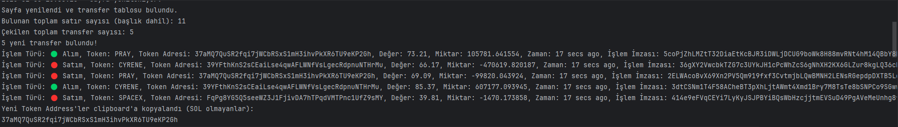
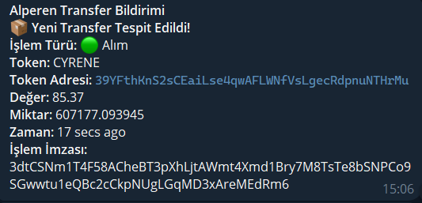
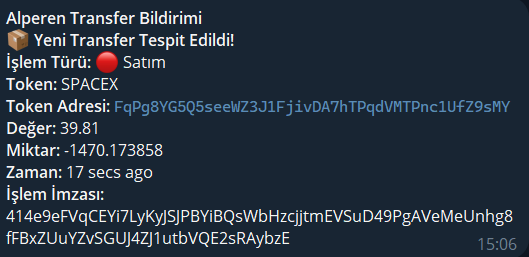

# Sol Scan Transfer Alert

## İçindekiler

- [Genel Bakış](#genel-bakış)
- [Özellikler](#özellikler)
- [Kullanılan Teknolojiler](#kullanılan-teknolojiler)
- [Uygulama Görselleri](#uygulama-görselleri)

---

## Genel Bakış

**SolScanTransferAlert**, SolScan üzerindeki token transferlerini gerçek zamanlı olarak izleyen, yeni transfer tespit edildiğinde kullanıcıyı Telegram üzerinden bilgilendiren ve ilgili token adreslerini kolayca erişilebilir kılan Python tabanlı izleme botudur. Proje, belirli kriterlere uyan işlemleri filtreleyerek sesli uyarılar ve clipboard entegrasyonu ile kullanıcı deneyimini artırmayı amaçlar.

---

## Özellikler

### **Gerçek Zamanlı İzleme**
- SolScan üzerindeki token transfer verilerini düzenli aralıklarla kontrol eder.
- Yeni transfer tespit edildiğinde anında uyarı mekanizmasını devreye alır.

### **Telegram Bildirimleri**
- Transfer detaylarını (işlem türü, token sembolü, token adresi, değer, miktar, zaman ve işlem imzası) içeren mesajları Telegram üzerinden gönderir.
- Bildirimlerin hızlı ve güvenilir şekilde iletilmesini sağlar.

### **Sesli Uyarılar**
- Yeni transfer veya hata durumlarında kullanıcıyı sesli uyarılar ile bilgilendirir.
- Dikkat çekici ses efektleri ile sistem durumunu anında bildirir.

### **Clipboard Entegrasyonu**
- SOL/WSOL dışındaki token adreslerini otomatik olarak clipboard'a kopyalayarak hızlı erişim imkanı sunar.

---

## Kullanılan Teknolojiler

- **Python** 
- **Selenium:** Web otomasyonu ve dinamik içerik kontrolü.
- **BeautifulSoup:** HTML verilerini ayrıştırmak ve analiz etmek.
- **Requests:** Telegram API'sine HTTP istekleri göndermek.
- **winsound:** Sesli uyarıların oluşturulması.
- **pyperclip:** Clipboard işlemleri.
---

## Uygulama Görselleri

### **1. Yapılan İşlemler**
Yapılan işlemleri gösteren konsol ekranı.

---

### **2. Telegram Bildirimi**
Yeni transfer tespit edildiğinde gönderilen Telegram mesajlarının örnekleri.

**Alım:**

**Satım:**

